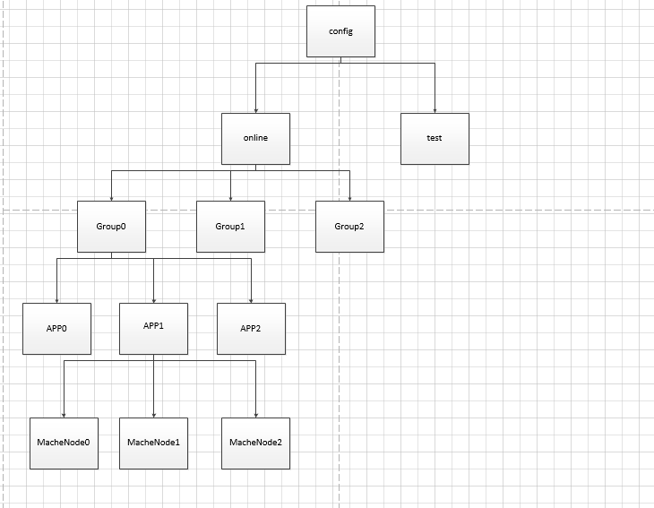
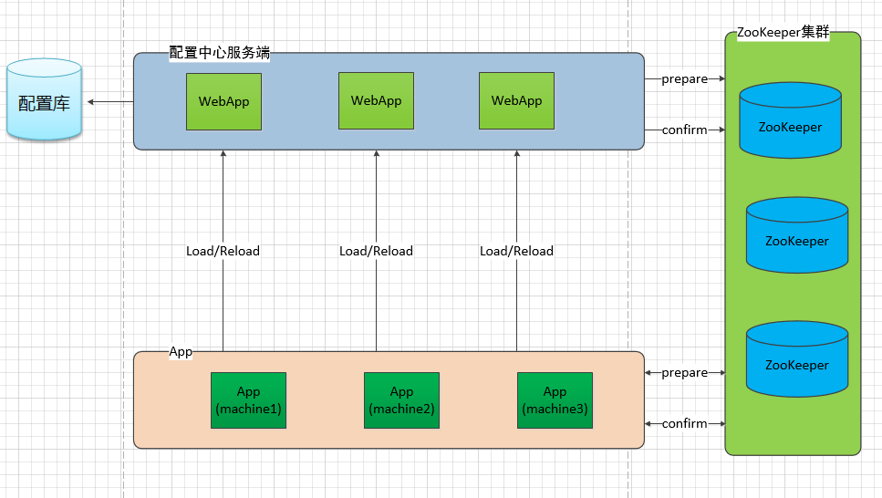

###配置中心

   应用程序缺少不了配置文件,比如config.properties,配置文件可以直接修改,也可以通过程序更改,能灵活的配置一些参数。
单机程序使用本地配置文件即可,在当今分布式应用程序大行其道的环境中,变更大量的应用配置工作很大,还容易出错,能热变更和集中
管理变更配置信息尤为重要,因此配置中心油然而生。

sharp-config
当前版本0.2.5
配置中心的核心理念
配置中心的目标是实现配置信息的中心化管理，对更改配置的行为无需重启系统，同时尽最大可能保证分布式情况下各个节点配置的一致性。

配置中心采用树形结构进行分层，并且这种分层结构与zookeeper上的目录结构保持一致。

第一层为环境。由于我们承担App可能在多个不同的环境下会有不同的配置情况，因此配置中心采用多个环境来支持，比如我们有线上环境(online)，开发环境（dev），12测试环境（12）等等。
第二层为组。组的概念是App的上一级，之所以有组的概念，是为了更好的管理App。例如：资金方组、公共交易组
第三层为App。App的概念就是我们的应用App。APP支持WebApplication及独立运行的Application，目前仅支持java应用。
整体结构如下图所示。

配置中心整体设计
配置中心分为两部分，服务端与客户端。服务端是指配置中心的后台，主要负责设置配置信息以及向客户端发送控制信息；客户端是应用的App，需要集成配置服务的client jar。
客户端在启动的时候会主动到服务端拉取最新的配置信息到应用本身进程的内存中并进行缓存，同时会在本地磁盘上保存一份配置信息。
配置中心的更新配置是分为两阶段进行的，首先由用户点击prepare按钮发起第一阶段，我们称之为prepare阶段，prepare阶段会从配置中心的服务端拉取准备要更新的配置到内存中（但是还并未替换正在使用的配置缓存）， 等到所用的机器都prepare成功之后，用户再次点击confirm按钮（此时用户可以看到每个机器的情况），此时应用中的配置缓存会被prepare阶段拉下来配置信息所替换。
两阶段提交的方式是为了尽最大努力保证在分布式的环境之下，来保持各个配置信息的一致性。

开发者使用指南
首先在POM中添加依赖
        <dependency>    
            <groupid>com.dafy.config</groupid>          
            <artifactid>sharp-config-client</artifactid>    
        </dependency>
        <dependency>   
            <groupid>org.apache.zookeeper</groupid>     
            <artifactid>zookeeper</artifactid>   
        </dependency>  
        <dependency>   
            <groupid>com.101tec</groupid>    
            <artifactid>zkclient</artifactid>    
        </dependency>    
        <dependency>    
            <groupid>com.google.guava</groupid>   
            <artifactid>guava</artifactid>    
        </dependency>
        <dependency>   
            <groupid>com.alibaba</groupid>     
            <artifactid>fastjson</artifactid>    
        </dependency>  
在项目中增加配置文件sharp.config.properties
关于sharp.config.properties的说明
测试环境的默认模板如下所示。

#######zookeeper-host      
zk.host=192.168.0.121:2181       
#######zookeeper的session超时时间(单位毫秒) 建议设置在10000-60000之间      
zk.session.timeout=10000       
#######zookeeper的连接超时时间(单位毫秒) 建议设置为10000       
zk.connection.timeout=10000       
#######模式 online模式则从配置中心获取配置  offline模式则从本地获取配置        
model=online         
#######配置中心的服务url          
remote.url=http://192.168.0.103:8000/api/       
#######本地配置保存的路径         
local.resource.path=D://DAFY/        
#######所属的环境       
env.name=example          
#######所属的组          
group.name=sharp-config-example         
#######所属的App         
app.name=SharpDemo        
3.初始化（建议在项目启动的时候就初始化，而不要在项目运行的时候初始化），如果初始化失败则会抛出异常。

       ConfigBuilder
           .build()
           .bind("app.properties")
           .start();

4.具体使用

    String value = ConfigBuilder.build().getString("app.properties","key");
上面只是针对最简单的key-value的示例，配置中心同时还支持json、xml、数据库配置的方式。
更多具体使用参考demo项目。

demo

